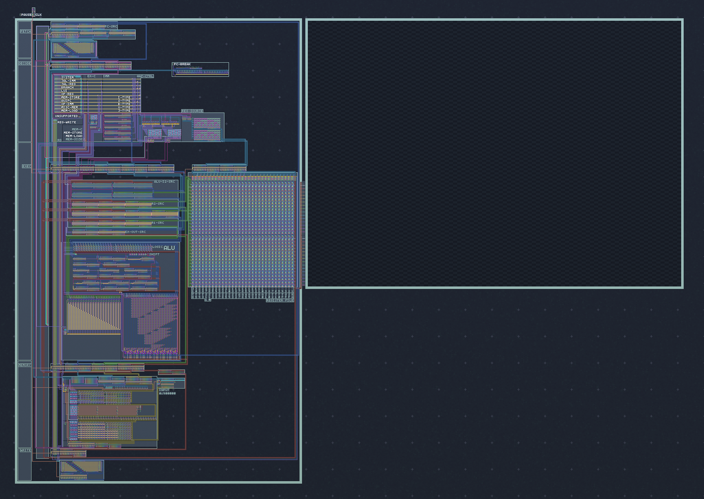

# vcb-riscv

Virtual Circuit Board (VCB) RISC-V CPU.

##### Demo

[Demo of CPU running Doom](https://github.com/user-attachments/assets/df3860e0-d931-43ab-8c04-e675d699a8ad)



## Virtual Circuit Board

This project is for use with Virtual Circuit Board (vcb).

Buy it on Steam: https://store.steampowered.com/app/1885690/Virtual_Circuit_Board/

## Components

There is a VCB file for various common components - `components.vcb`.

It includes labels for everything and should be relatively straight-forward to understand.

## CPU

There is a VCB file for a RISC-V CPU - `cpu-v0_1.vcb`.

See [CPU-V0_1.md](CPU-V0_1.md) for more details.

## Software

The project contains C/C++ code and a CMake/Make toolchain to compile these.

See [Tests](#tests) for details on running tests.

### Dependencies

If you're on Windows, you can use WSL (Windows Subsystem for Linux) to run everything.
(You can run VCB itself in Windows.)

You need to have the following installed:

* CMake (already installed on most systems)
* Make (already installed on most systems)
* gcc (riscv64-unknown-elf-gcc)
    * Run `setup/ubuntu-riscv-gnu-toolchain.sh` for easy setup on Ubuntu.

Note: Everything has been tested on Ubuntu (WSL).
But it should work on most Linux distros and possibly on Mac.

### Source Code

The `src` folder contains C/C++ source code.
Each program is in its own folder.

Note: Using C/C++ standard library is not well tested.
Contributions to add support for this are especially welcome.

### Quickstart

To compile everything:

```bash
cmake .
make
```

### CMake

`CMakeLists.txt` files are used to configure the compilation.

Running `cmake .` will generate a `Makefile`.
You'll need to re-run this if you change the `CMakeLists.txt` files.

### Compilation

Running `make` will compile all code in the `src` folder to:

* `build/<program>.vcbmem` - VCB VMEM file
    * VCB 'VMEM Editor' tab has an 'Edit VMEM externally' button (bottom left) to load this into VMEM.
* `build/<program>.elf` - Main ELF executable
* `build/<program>.elf.d` - RISC-V assembly
    * Disassembled from the main ELF executable.
    * Effectively, the exact assembly used for the `.vcbmem`.

Run `make help` for all available targets.

### Using vcbmem files

To make it easier to use the `.vcbmem` files, you can run:

```bash
make cpu_<program>
```

This will compile the program and copy the .vcbmem file next to the CPU VCB project.
(I.e. `build/<program>.vcbmem` to `<CPU_NAME>.vcbmem`. CPU_NAME is defined in `CMakelists.txt`.)

### Configuring VCB project

Some programs may assume the VCB project to be configured a certain way.
(For example, to have a specific virtual display size.)

To automatically configure the VCB project, you can run:

```bash
make cpu_config_<program>
```

See `vcb_project_config` folder for details.

## Tests

Tests can be run semi-automatically for the CPU
using [RISCOF - The RISC-V Compatibility Framework](https://riscof.readthedocs.io/en/stable/intro.html).

Each test is run on a reference CPU (Spike) and the VCB CPU (i.e. DUT - Device Under Test).
The tests write to a specific memory area, resulting in a 'signature'.
The signatures are compared to determine if the test passed or failed.

### Dependencies

You need to have the following installed:

* CMake (already installed on most systems)
* Make (already installed on most systems)
* Python 3 & pip (already installed on most systems)
* gcc (riscv64-unknown-elf-gcc)
    * Run `setup/ubuntu-riscv-gnu-toolchain.sh` for easy setup on Ubuntu.
* [RISCOF](https://riscof.readthedocs.io/en/stable/installation.html#install-riscof)
    * Run `setup/ubuntu-riscof.sh` for easy setup on Ubuntu.
* [Spike](https://github.com/riscv-software-src/riscv-isa-sim#build-steps)
    * Run `setup/ubuntu-spike.sh` for easy setup on Ubuntu.

You'll also need to run `cmake .` once to generate the `Makefile`.

#### Testing in VCB

**NB:** You need to enable persistent VMEM in VCB.
You can do this by setting VMEM Settings -> Persistent Memory to be `0x0` to `0xfffff`

During a test run, the script will handle all the compilation and .vcbmem file management.

Running the test in VCB has to be done manually.
During a test run, GNOME Terminal windows are opened with instructions.

### Running all tests

To run all tests:

```
make riscof_run_all
```

Note: There are a lot of tests.
As each of them requires a manual step, it might be better to run them individually.

### Running a specific test

To run a specific test, first generate separate test files:

```
make riscof_separate_tests
```

Then run the test:

```
make -e TEST_NAME=<test> riscof_run
```

### Test results

After running a test, an HTML report is generated in `riscof/riscof_work/report.html`.

The signatures files are stored in `riscof/riscof_work/rv32i_m/I/src/*/dut|ref/*.signature`.

### Debugging

#### Disassembly

To get a better idea of what the test are doing, you can then view the disassembled assembly files
in `riscof/riscof_work/rv32i_m/I/src/*/dut/my.elf.d`.
(This is the exact assembly used for the `.vcbmem`.)

#### Source code

You can find the source code for each test in `riscof/riscv-arch-test/riscv-test-suite/rv32i_m/I/src`.

Note that these use macros, which can obfuscate things a bit.
You can find the macros in `riscof/riscv-arch-test/riscv-test-suite/env`

#### Debugging in VCB

You can debug the test in VCB by letting the test copy the `.vcbmem` file and stopping it.

Note: I'm not sure if the tests are idempotent, so you might want to disable VMEM persistence while doing this.

## Contributing

Feel free to open issues and pull requests for improvements :)
